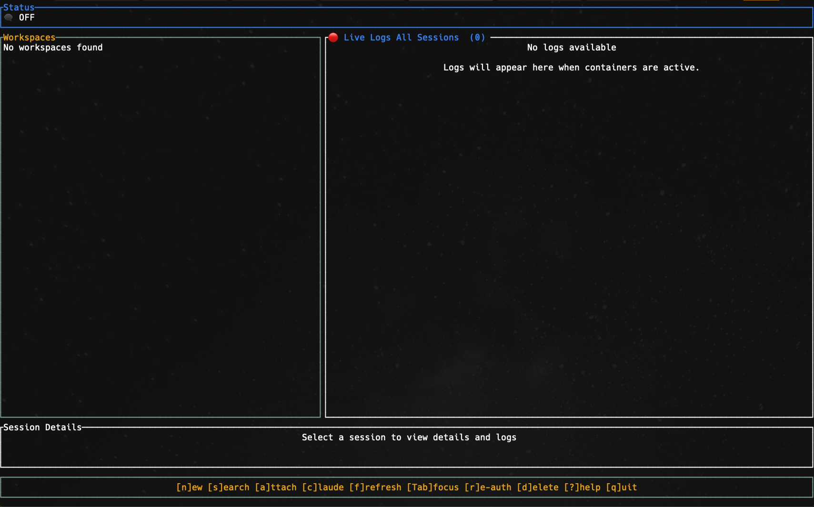

# Claude-in-a-Box

A terminal-based development environment manager that creates isolated Docker containers with Claude AI tools, MCP servers, and dedicated git worktrees. Quickly spin up, manage, and switch between multiple AI-assisted coding sessions across different projects.


## 📋 Table of Contents

- [✨ Features](#-features)
- [🚀 Installation](#-installation)
- [⚡ Quick Start](#-quick-start)
- [🎮 Usage](#-usage)
- [📋 Configuration](#-configuration)
- [🏗️ Architecture](#️-architecture)
- [🧪 Development](#-development)
- [🔧 Troubleshooting](#-troubleshooting)
- [🤝 Contributing](#-contributing)
- [📄 License](#-license)

## ✨ Features

- **Isolated Sessions**: Each coding session runs in its own Docker container with dedicated git worktree
- **Multi-Project Support**: Manage sessions across multiple git repositories
- **Container Templates**: Pre-configured development environments (Node.js, Python, Rust, Claude-dev)
- **MCP Server Integration**: Automated setup of Serena, Context7, and other MCP servers
- **Flexible Configuration**: JSON/TOML configuration with project-specific overrides
- **Authentication Management**: Seamless Claude API key and credential handling
- **Terminal UI**: Intuitive split-pane interface with vim-style navigation
- **Real-time Monitoring**: Container status, logs, and resource usage
- **Session Persistence**: Resume sessions after application restart

## 🚀 Installation

### Prerequisites

- **Docker** (required) - [Install Docker](https://docs.docker.com/get-docker/)
- **Rust** (latest stable) - [Install Rust](https://rustup.rs/)
- **Git** - For worktree management
- **Claude API Key** - Get from [Anthropic Console](https://console.anthropic.com/)

### Step 1: Install and Build

```bash
# Clone the repository
git clone https://github.com/your-org/claude-box
cd claude-box

# Build the project
cargo build --release
```

### Step 2: Start Docker

**Ensure Docker is running before proceeding:**

```bash
# macOS with Docker Desktop
open -a Docker
echo "Waiting for Docker Desktop to start..."
# Wait until this command succeeds:
docker info

# Linux with systemd
sudo systemctl start docker
sudo systemctl enable docker  # Start on boot
docker info  # Should succeed without errors

# Alternative Linux (service command)
sudo service docker start
docker info
```

**Windows Users:**

1. Start Docker Desktop from the Start Menu
2. Wait for the system tray icon to show "Docker Desktop is running"
3. Open PowerShell/Command Prompt and verify: `docker info`

**Verify Docker is Working:**

```bash
# This command should complete without errors
docker run --rm hello-world
```

### Step 3: First Run & Authentication

```bash
# Run claude-in-a-box
cargo run
```

**First-time authentication flow:**

1. **Authentication Container**: On first run, an authentication container will start automatically
2. **Browser Authentication**: Click the authentication link that appears in the terminal output
3. **Complete Auth**: Log in to Claude in your browser and copy the authentication code
4. **Return to Terminal**: Paste the code when prompted in the terminal
5. **Exit Auth Container**: Press `Ctrl+C` to stop the authentication container
6. **TUI Launch**: The main TUI interface will appear (see screenshot above)

> **Important**: The authentication process runs in a Docker container for security isolation and to prevent interference with the host version of claude code. Make sure to complete the browser authentication step and copy the code back to the terminal before pressing Ctrl+C.



> **Note**: Authentication runs in a container for isolation. After completing auth, you'll see the main TUI interface shown above. The interface shows workspaces on the left, live logs on the right, and session details at the bottom.

## ⚡ Quick Start

### Alternative Authentication Methods

If you prefer to authenticate before running claude-in-a-box:

```bash
# Option 1: Use Claude CLI to authenticate
claude auth login

# Option 2: Set environment variable
export ANTHROPIC_API_KEY="your-api-key"

# Option 3: Manual .claude.json (in home directory)
echo '{"api_key": "your-api-key"}' > ~/.claude.json
```

### Your First Session

1. **Start Application**: `cargo run`
2. **Navigate**: Use arrow keys or `j/k` to navigate workspaces
3. **Create Session**: Press `n` to create a new session
4. **Choose Template**: Select `claude-dev` (default) or another template
5. **Enter Branch**: Type a branch name (will be prefixed with `claude/`)
6. **Wait for Setup**: First-time setup downloads container images (~5 minutes)
7. **Attach to Session**: Press `a` to enter the container
8. **Start Coding**: Your workspace is mounted at `/workspace`

```bash
# Inside the container session
cd /workspace          # Your project files
claude                 # Start Claude CLI with MCP servers
git status             # Git operations work normally
npm run dev            # Development servers (ports forwarded)
```

## 📋 Configuration

### Configuration Hierarchy

Claude-in-a-Box uses a hierarchical configuration system:

1. **System config**: `/etc/claude-in-a-box/config.toml`
2. **User config**: `~/.claude-in-a-box/config/config.toml`
3. **Project config**: `.claude-in-a-box/project.toml`

### Global Configuration

Create `~/.claude-in-a-box/config/config.toml`:

```toml
# Application version (automatically set)
version = "0.1.0"

# Default container template to use
default_container_template = "claude-dev"

# Container templates available
[container_templates.claude-dev]
name = "claude-dev"
description = "Claude development environment with MCP servers"

[container_templates.claude-dev.config]
# Uses claude-docker based setup
image_source = { type = "ClaudeDocker", base_image = "node:20-slim" }
working_dir = "/workspace"
memory_limit = 4096  # MB
cpu_limit = 2.0      # CPUs
mount_ssh = true
mount_git_config = true

# MCP server configurations
[mcp_servers.serena]
name = "serena"
description = "AI coding agent"
enabled_by_default = true

[mcp_servers.context7]
name = "context7"
description = "Library documentation and examples"
enabled_by_default = true

[mcp_servers.twilio]
name = "twilio"
description = "SMS notifications"
enabled_by_default = false
required_env = ["TWILIO_AUTH_TOKEN", "TWILIO_ACCOUNT_SID", "TWILIO_FROM_PHONE"]

# Global environment variables
[environment]
NODE_ENV = "development"
CLAUDE_BOX_MODE = "true"

# Workspace defaults
[workspace_defaults]
branch_prefix = "claude/"
auto_detect = true
exclude_paths = ["node_modules", ".git", "target", "dist"]
# Additional paths to scan for git repositories
workspace_scan_paths = [
    "/Users/stevengonsalvez/d/git",
    "/path/to/your/projects"
]

# UI preferences
[ui_preferences]
theme = "dark"
show_container_status = true
show_git_status = true
```

### Project Configuration

Create `.claude-in-a-box/project.toml` in your project root:

```toml
# Container template to use for this project
container_template = "claude-dev"

# Whether to mount ~/.claude directory
mount_claude_config = true

# Project-specific environment variables
[environment]
NODE_ENV = "development"
DEBUG = "myapp:*"
API_URL = "http://localhost:3000"

# Custom container configuration overrides
[container_config]
memory_limit = 8192  # MB
cpu_limit = 4.0      # CPUs

# Additional volume mounts
[[additional_mounts]]
host_path = "~/.ssh"
container_path = "/home/claude-user/.ssh"
read_only = true

[[additional_mounts]]
host_path = "./docker-compose.yml"
container_path = "/workspace/docker-compose.yml"
read_only = false

# MCP servers to enable for this project
mcp_servers = ["serena", "context7"]
```

### Container Templates

#### Built-in Templates

1. **claude-dev** (default): Full Claude development environment
   - Base: `node:20-slim`
   - Tools: Claude CLI, Gemini CLI, Git, Python, build tools
   - MCP Servers: Serena, Context7, Twilio (optional)
   - User: `claude-user` (UID/GID matched to host)

2. **node**: Node.js development environment
   - Base: `node:20-slim`
   - Tools: Node.js, npm, Git, build tools
   - No MCP servers by default

3. **python**: Python development environment
   - Base: `python:3.11-slim`
   - Tools: Python, pip, Git, build tools
   - No MCP servers by default

4. **rust**: Rust development environment
   - Base: `rust:1.75-slim`
   - Tools: Rust, Cargo, Git, build tools
   - No MCP servers by default

#### Custom Templates

Add custom templates to your configuration:

```toml
[container_templates.my-custom]
name = "my-custom"
description = "Custom development environment"

[container_templates.my-custom.config]
image_source = { type = "Image", name = "my-custom-image:latest" }
working_dir = "/workspace"
memory_limit = 2048
cpu_limit = 1.0
ports = [3000, 8080]
system_packages = ["vim", "curl"]
npm_packages = ["typescript", "nodemon"]
```

### MCP Server Configuration

#### Default MCP Servers

- **Serena** (`@ambergristle/serena`): AI coding agent
- **Context7** (`context7`): Library documentation and examples
- **Twilio** (`@twilio-labs/mcp-server-twilio`): SMS notifications

#### MCP Initialization Strategies

1. **Per-Container** (isolated): Install MCP servers in each container
2. **Central Mount** (shared): Mount host `~/.claude` directory
3. **Hybrid** (default): Install in container + mount host config

Configure in your `config.toml`:

```toml
[mcp_init_strategy]
type = "Hybrid"
config_path = "~/.claude"
merge_configs = true
```

### Docker Configuration

#### Automatic Docker Detection

Claude-in-a-Box automatically detects Docker installations across different platforms:

**Detection Priority:**

1. **Environment Variable**: `DOCKER_HOST` (highest priority)
2. **Docker Context**: Current active Docker context
3. **Platform Detection**: OS-specific socket locations
4. **Fallback**: Default Docker connection

**Supported Platforms:**

**macOS:**

- Docker Desktop: `~/.docker/run/docker.sock`
- Colima: `~/.colima/default/docker.sock`
- Podman Desktop: `~/.local/share/containers/podman/machine/podman.sock`

**Linux:**

- Standard Docker: `/var/run/docker.sock`
- Rootless Docker: `$XDG_RUNTIME_DIR/docker.sock`
- Podman: `$XDG_RUNTIME_DIR/podman/podman.sock`

**Windows:**

- Docker Desktop: `npipe:////./pipe/docker_engine`
- WSL2: `/var/run/docker.sock`

#### Manual Docker Configuration

If automatic detection fails, you can manually configure Docker:

**Environment Variable:**

```bash
# Unix socket
export DOCKER_HOST=unix:///var/run/docker.sock

# TCP connection
export DOCKER_HOST=tcp://localhost:2376

# Windows named pipe
export DOCKER_HOST=npipe:////./pipe/docker_engine
```

**Global Configuration:**

```toml
# ~/.claude-in-a-box/config/config.toml
[docker]
host = "unix:///var/run/docker.sock"
# or
host = "tcp://localhost:2376"
# or for Windows
host = "npipe:////./pipe/docker_engine"

# Connection timeout (seconds)
timeout = 60

# TLS configuration (for TCP connections)
[docker.tls]
ca_cert = "/path/to/ca.pem"
client_cert = "/path/to/cert.pem"
client_key = "/path/to/key.pem"
```

**Project Configuration:**

```toml
# .claude-in-a-box/project.toml
[docker]
host = "unix:///custom/docker.sock"
timeout = 30
```

#### Docker Context Integration

Claude-in-a-Box integrates with Docker contexts:

```bash
# List Docker contexts
docker context ls

# Switch to a different context
docker context use my-remote-docker

# Claude-in-a-Box will automatically use the active context
cargo run
```

#### Docker Connection Troubleshooting

**Check Docker Status:**

```bash
# Verify Docker is running
docker info

# Check current context
docker context show

# Test Docker connectivity
docker ps
```

**Common Issues:**

1. **Permission Denied (Linux):**

   ```bash
   # Add user to docker group
   sudo usermod -aG docker $USER
   # Log out and back in
   ```

2. **Docker Desktop Not Started (macOS/Windows):**

   ```bash
   # Start Docker Desktop
   open -a Docker  # macOS
   # or start Docker Desktop from Applications
   ```

3. **Socket Not Found:**

   ```bash
   # Check if Docker socket exists
   ls -la /var/run/docker.sock
   # or check Docker Desktop socket
   ls -la ~/.docker/run/docker.sock
   ```

4. **Connection Refused:**

   ```bash
   # Check Docker daemon status
   systemctl status docker  # Linux
   # or restart Docker Desktop
   ```

**Debug Docker Connection:**

```bash
# Run with debug logging to see Docker detection
RUST_LOG=debug cargo run
```

### Workspace Scanning

Claude-in-a-Box automatically scans for Git repositories in your system. By default, it searches in common development directories:

**Default Search Paths:**

- `~/projects`
- `~/code`
- `~/dev`
- `~/workspace`
- `~/src`
- `~/repos`
- `~/Desktop`
- `~/Documents`
- Current directory (if it's a git repository)

**Configuring Additional Search Paths:**

If your repositories are in custom locations (e.g., `/Users/you/d/git`), add them to your configuration:

```toml
# ~/.claude-in-a-box/config/config.toml
[workspace_defaults]
workspace_scan_paths = [
    "/Users/you/d/git",
    "/opt/projects",
    "/mnt/code"
]
```

The scanner will:

- Recursively search up to 3 levels deep
- Skip common build/dependency directories (node_modules, target, etc.)
- Only include directories that are valid Git repositories
- Merge results from all configured paths with default paths

### Authentication Setup

#### Claude API Key

```bash
# Option 1: Environment variable
export ANTHROPIC_API_KEY="your-api-key"

# Option 2: Claude CLI authentication
claude auth login

# Option 3: Manual .claude.json (in home directory)
echo '{"api_key": "your-api-key"}' > ~/.claude.json
```

#### Optional: Twilio (for SMS MCP server)

```bash
export TWILIO_AUTH_TOKEN="your-auth-token"
export TWILIO_ACCOUNT_SID="your-account-sid"
export TWILIO_FROM_PHONE="+1234567890"
```

### Environment Variables

#### Required

- `ANTHROPIC_API_KEY`: Claude API key

#### Optional

- `CLAUDE_BOX_MODE`: Set to "true" for claude-box specific behavior
- `TWILIO_AUTH_TOKEN`: Twilio authentication token
- `TWILIO_ACCOUNT_SID`: Twilio account SID
- `TWILIO_FROM_PHONE`: Twilio phone number for SMS
- `USE_GEMINI`: Set to "true" to use Gemini CLI instead of Claude
- `RUST_LOG`: Set to "debug" for detailed logging

## 🎮 Usage

### TUI Interface Overview

The claude-in-a-box interface is divided into several sections:

- **Status Bar** (top): Shows application status and Docker connection
- **Workspaces** (left): Lists detected Git repositories
- **Live Logs** (top right): Container logs and status updates
- **Session Details** (bottom): Selected session information
- **Help Bar** (bottom): Available keyboard shortcuts

### Keyboard Navigation

#### Basic Movement

```
j / ↓      Move down in session list
k / ↑      Move up in session list
h / ←      Previous workspace
l / →      Next workspace
g          Go to top of list
G          Go to bottom of list
```

#### Session Management

```
n          Create new session
a          Attach to session (opens interactive terminal)
s          Start/Stop session
d          Delete session
r          Refresh workspace list
```

#### Interface Controls

```
?          Toggle help overlay
Tab        Switch between panes
q / Esc    Quit application
Ctrl+C     Force quit
```

### Creating Your First Session

1. **Launch**: Run `cargo run` to start claude-in-a-box
2. **Authenticate**: Complete first-time authentication if needed
3. **Select Workspace**: Navigate to a Git repository in the left panel
4. **Create Session**: Press `n` to create a new session
5. **Configure**:
   - **Template**: Choose `claude-dev` (recommended) or other templates
   - **Branch Name**: Enter a descriptive name (auto-prefixed with `claude/`)
   - **Options**: Configure memory/CPU limits if needed
6. **Build & Start**: Wait for container image build and startup
7. **Attach**: Press `a` to enter the interactive session

### Working in Sessions

#### Container Environment

Each session provides:

- **Workspace Mount**: Your project at `/workspace`
- **Claude CLI**: Pre-configured with MCP servers
- **Development Tools**: Git, Node.js, Python, build tools
- **Port Forwarding**: Development servers accessible on host
- **Isolated Git**: Dedicated worktree for clean branching

#### Common Workflow

```bash
# Inside a session container
cd /workspace              # Navigate to your project
ls -la                    # View project files
git status                # Check current branch (isolated worktree)

# Start Claude with MCP servers
claude                    # Full AI assistance with context

# Development commands work normally
npm install               # Install dependencies
npm run dev               # Start dev server (ports auto-forwarded)
python -m venv venv       # Create virtual environments
cargo build               # Build Rust projects

# Git operations in isolated branch
git add .
git commit -m "feature: implement new functionality"
git push origin claude/feature-branch
```

#### Session Lifecycle

- **Active**: Container running, can attach anytime
- **Stopped**: Container paused, data preserved
- **Deleted**: Container and worktree removed

### Multi-Project Management

**Workspace Auto-Detection**:

- Scans common development directories
- Recursively finds Git repositories
- Configurable search paths
- Real-time workspace refresh (`r` key)

**Session Organization**:

- Multiple sessions per project supported
- Each session has isolated git worktree
- Independent container environments
- Resource usage monitoring

### Advanced Features

#### Container Templates

- **claude-dev**: Full AI development environment
- **node**: Node.js focused environment
- **python**: Python development setup
- **rust**: Rust development environment
- **custom**: User-defined templates

#### MCP Server Integration

- **Serena**: AI coding agent toolkit
- **Context7**: Library documentation access
- **Twilio**: SMS notifications (optional)
- **Custom**: Add your own MCP servers

#### Resource Management

- Memory and CPU limits per container
- Port forwarding for development servers
- Volume mounts for SSH keys, configs
- Container health monitoring

### Project Setup Examples

#### Node.js Project

```bash
# Create project config
mkdir -p .claude-in-a-box
cat > .claude-in-a-box/project.toml << EOF
container_template = "node"
mount_claude_config = true

[environment]
NODE_ENV = "development"
PORT = "3000"

[container_config]
memory_limit = 4096
cpu_limit = 2.0
EOF

# Start claude-in-a-box
cargo run
```

#### Python Project

```bash
# Create project config
mkdir -p .claude-in-a-box
cat > .claude-in-a-box/project.toml << EOF
container_template = "python"
mount_claude_config = true

[environment]
PYTHONPATH = "/workspace"
DEBUG = "true"

[[additional_mounts]]
host_path = "./requirements.txt"
container_path = "/workspace/requirements.txt"
read_only = false
EOF

# Start claude-in-a-box
cargo run
```

## 🏗️ Architecture

### Project Structure

```
src/
├── app/              # Application state and event handling
├── components/       # TUI components (session list, logs, help)
├── config/           # Configuration management
│   ├── mod.rs        # Configuration loading and merging
│   ├── container.rs  # Container templates
│   ├── mcp.rs        # MCP server definitions
│   └── mcp_init.rs   # MCP initialization strategies
├── docker/           # Docker container management
│   ├── builder.rs    # Docker image building
│   ├── container_manager.rs  # Low-level Docker operations
│   ├── session_container.rs  # Container models
│   └── session_lifecycle.rs  # High-level session orchestration
├── git/              # Git worktree operations
├── models/           # Data structures (Session, Workspace, etc.)
└── main.rs          # Application entry point

docker/
└── claude-dev/       # Claude development container
    ├── Dockerfile    # Based on claude-docker
    ├── scripts/      # Startup and installation scripts
    └── config/       # Container configuration files

Configuration files:
~/.claude-in-a-box/config/config.toml    # Global user configuration
.claude-in-a-box/project.toml     # Project-specific configuration
```

### Development Phases

- **✅ Phase 1**: UI Foundation - Complete TUI with navigation
- **✅ Phase 2**: Data Models - Session and workspace management
- **✅ Phase 3**: Git Integration - Worktree creation and management
- **✅ Phase 4**: Docker Integration - Container lifecycle management
- **✅ Phase 4.5**: Configuration & Templates - Complete config system
- **🔄 Phase 5**: Interactive Features - Enhanced UI and monitoring
- **📋 Phase 6**: Persistence & Polish - State management and optimization

## 🧪 Development

### Requirements

- Rust 1.70+
- Docker daemon running
- Git repositories for testing

### Development Setup

```bash
# Clone and build
git clone https://github.com/your-org/claude-box
cd claude-box
cargo build

# Run tests (some require Docker)
cargo test

# Run integration tests
cargo test --ignored

# Run with debug logging
RUST_LOG=debug cargo run
```

### Building Docker Images

```bash
# Build the claude-dev container template
docker build -t claude-box:claude-dev docker/claude-dev/

# Or let claude-in-a-box build it automatically on first use
cargo run  # Will build images as needed
```

## 🔧 Troubleshooting

### Common Issues

#### Authentication Problems

```bash
# Check Claude authentication
claude auth whoami

# Verify API key
echo $ANTHROPIC_API_KEY

# Check .claude.json
cat ~/.claude.json
```

#### Docker Issues

```bash
# Check Docker daemon
docker ps

# Check Docker connectivity
docker version

# Check Docker socket connection
docker info

# List claude-box containers
docker ps -a --filter "label=claude-managed=true"

# View container logs
docker logs <container-id>
```

**Docker Connection Issues:**

1. **Check Docker Detection:**

   ```bash
   # Run with debug logging to see detection process
   RUST_LOG=debug cargo run

   # Look for these log messages:
   # "Using Docker host from config: ..."
   # "Using DOCKER_HOST: ..."
   # "Found Docker socket at: ..."
   ```

2. **Manual Docker Configuration:**

   ```bash
   # Create config file
   mkdir -p ~/.claude-in-a-box/config
   cat > ~/.claude-in-a-box/config/config.toml << EOF
   [docker]
   host = "unix:///var/run/docker.sock"
   timeout = 60
   EOF
   ```

3. **Override with Environment:**

   ```bash
   # For Docker Desktop on macOS
   export DOCKER_HOST=unix:///Users/$USER/.docker/run/docker.sock

   # For standard Docker on Linux
   export DOCKER_HOST=unix:///var/run/docker.sock

   # For Windows Docker Desktop
   export DOCKER_HOST=npipe:////./pipe/docker_engine
   ```

#### Container Build Issues

```bash
# Manual build of claude-dev template
cd docker/claude-dev
docker build -t claude-box:claude-dev .

# Check if images exist
docker images | grep claude-box
```

#### MCP Server Issues

```bash
# Check MCP configuration
cat ~/.claude/mcp-config.json

# Verify MCP servers are installed (in container)
docker exec <container-id> npm list -g

# Check environment variables
docker exec <container-id> env | grep -E "(ANTHROPIC|TWILIO)"
```

#### Git Worktree Issues

```bash
# List existing worktrees
git worktree list

# Remove stale worktrees
git worktree prune

# Check claude-box worktrees and configuration
ls -la ~/.claude-in-a-box/
```

### Debug Mode

Enable detailed logging:

```bash
export RUST_LOG=debug
cargo run
```

### Performance Optimization

```toml
# In config.toml
[container_templates.claude-dev.config]
memory_limit = 2048    # Reduce memory usage
cpu_limit = 1.0        # Limit CPU usage

[workspace_defaults]
exclude_paths = ["node_modules", ".git", "target", "dist", ".next"]
```

### Container Resource Monitoring

```bash
# Monitor container resource usage
docker stats $(docker ps --filter "label=claude-managed=true" -q)

# Check disk usage
docker system df

# Clean up unused containers/images
docker system prune
```

## 🤝 Contributing

We welcome contributions! Please see our [Contributing Guide](CONTRIBUTING.md).

### Getting Started

1. Fork the repository
2. Create a feature branch: `git checkout -b feature/amazing-feature`
3. Make your changes
4. Run tests: `cargo test`
5. Check formatting: `cargo fmt`
6. Check linting: `cargo clippy`
7. Commit: `git commit -m 'Add amazing feature'`
8. Push: `git push origin feature/amazing-feature`
9. Open a Pull Request

### Development Guidelines

- Follow Rust best practices and idioms
- Write tests for new functionality
- Update documentation as needed
- Use conventional commit messages
- Ensure Docker integration tests pass

## 📄 License

This project is licensed under the MIT License - see the [LICENSE](LICENSE) file for details.

## 🙏 Acknowledgments

- [Ratatui](https://github.com/ratatui-org/ratatui) - Terminal UI framework
- [Bollard](https://github.com/fussybeaver/bollard) - Docker API client
- [Claude Code](https://docs.anthropic.com/en/docs/claude-code) - AI pair programming
- [Crossterm](https://github.com/crossterm-rs/crossterm) - Cross-platform terminal library
- [claude-docker](https://github.com/stevengonsalvez/claude-docker) - Container setup inspiration

## 🔗 Related Projects

- [Claude Code](https://docs.anthropic.com/en/docs/claude-code) - Official Claude CLI
- [Docker](https://docker.com) - Containerization platform
- [Git Worktree](https://git-scm.com/docs/git-worktree) - Multiple working trees
- [MCP](https://modelcontextprotocol.io/) - Model Context Protocol

---

**Made with ❤️ by the Claude-in-a-Box team**

For questions, issues, or feature requests, please [open an issue](https://github.com/your-org/claude-box/issues).
